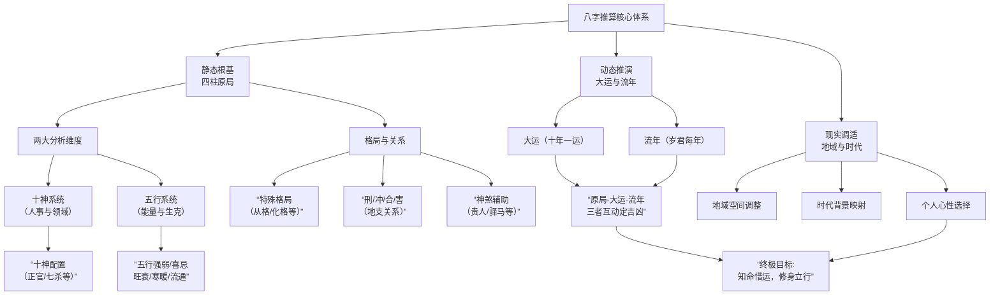

您提了一个非常关键的问题！**当然不止这两种**，您提到的“四柱结构”和“十神配置”是分析八字的**两大核心框架**，但要真正解读八字，还需要在这两大框架的基础上，进行更深层次、更动态的综合分析。

简单来说，可以概括为 **“一体两翼，三层分析”**：

*   **一体**：**四柱八字原局** —— 这是永远不变的基本盘，是“命”的部分。
*   **两翼**：**十神系统**（人事关系与领域） 与 **五行系统**（能量本质与生克）—— 这是从两个不同维度剖析原局的工具。
*   **三层分析**：在分析原局（静态）后，必须加入**大运**（中期趋势）和**流年**（短期应期）进行动态推演。

为了让您更清晰地了解八字推算的全貌，以下是需要综合考虑的完整分析体系图示：

上图清晰地展示了，**四柱和十神是分析的起点，但远非终点**。一个完整的八字论断，需要将所有模块有机结合：

1.  **两大维度的交织**：看十神时，必须结合其**五行本质**。例如，“正官”是吉神，但如果它五行属火，而命局本身火炎土燥，这个“正官”带来的可能是压力而非贵气。
2.  **格局与关系的定性**：原局中的**刑冲合害**会根本性地改变五行力量。比如“合杀留官”或“冲开财库”，是判断事件性质的关键。特殊格局（如从旺、从弱）则需完全跳出普通旺衰理论。
3.  **动态时空的激活**：原局是种子，**大运是气候，流年是节气**。再好（或再差）的原局，也需等待大运流年来引发。这就是“命好不如运好”的道理。
4.  **现实世界的映射**：最终，抽象的五行生克要落到具体的人生领域（财运、感情、健康等），并考虑**时代、地域、个人选择**的调节作用。例如古代“驿马”多应车马劳顿，现代可能应航空旅行或频繁出差。

**总结而言：**
八字如同一部复杂的机器。
- **四柱**是机器的**主体结构**。
- **十神和五行**是描述其内部**零件功能（十神）和动力原理（五行）** 的两套说明书。
- **刑冲合害**是零件之间的**连接与传动方式**。
- **大运流年**是外部输入的**不同电流与操作指令**。
- **现实境遇**则是这台机器最终**产出的具体产品**。

因此，高明的分析者绝不会只看一两个零件，而是通观整体结构与运行状态，才能做出贴近人生的推断。希望这个系统性的解释能帮助您更深入地理解这门古老的学问。